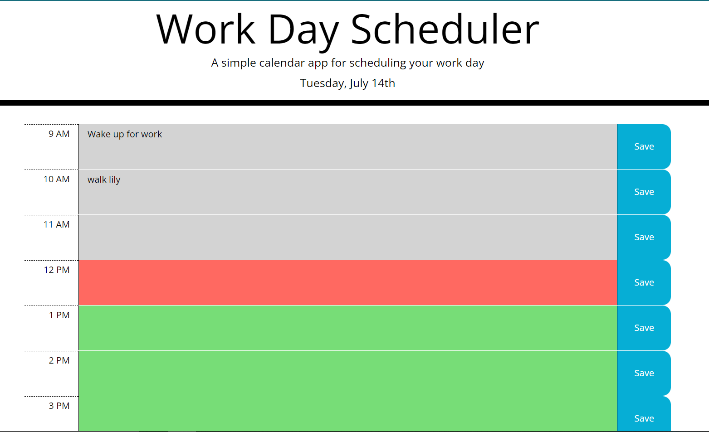

# Work Day Scheduler Starter Code

An application that when run will begin display a day planner for the current day.

When the user opens the page, the current date is displayed on the top of hte page.

When the user scrolls down, there will be hour blocks for the day displayed along with empty areas to enter in events.

The application takes the current time into account and will display different colors depending if the hour has passed, is current, or has yet to begin.

When the user clicks in the empty input area, the box will be highlighted to show it is active and the user can fill in as many boxes as they need.

When the user selects "save", the user's inputs are saved into the local storage and are displayed once more when the user refreshes.

Since moment.js is outdated, I used Luxon as an alternative which was written by one of the creators of moment.js.

Link to deployed application:
https://va-lopez.github.io/Third_party_APIs_scheduler/

Link to screenshots:
